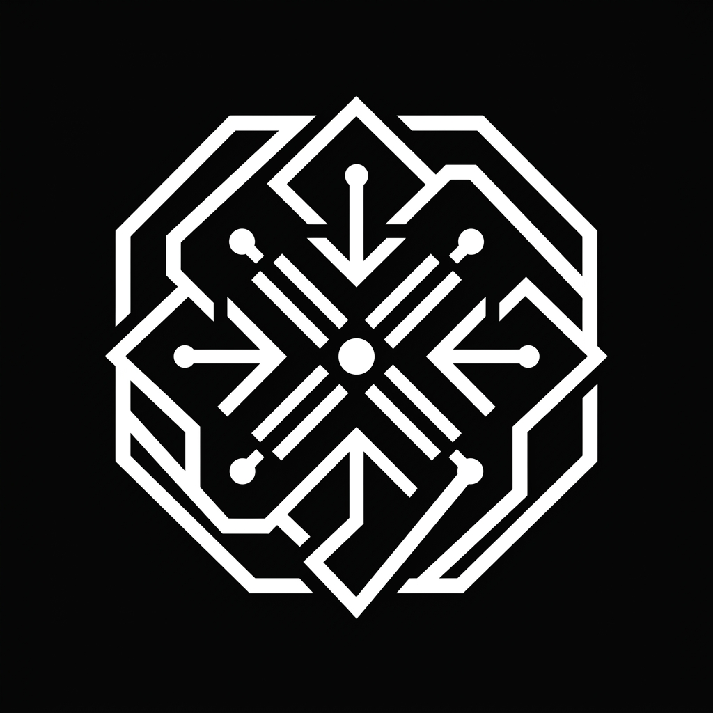

# ◈ YASSIN RAGAB — AI ENGINEER

<div align="center">
  
  <p align="center"><i>Decoding complexity through high-performance neural interfaces.</i></p>
</div>

---

### [ ❖ THE MANIFESTO ]
This repository contains the architecture for my personal **Neural Flight** portfolio — a scrollytelling experience built on the principles of **kinetic interaction, high-typography, and frame-perfect animations.**

### [ ◈ CORE ENGINE ]
*   **Engine:** Vanilla HTML5 / ES6+ Javascript
*   **Motion Architecture:** GSAP (GreenSock Animation Platform) + ScrollTrigger
*   **Aesthetics:** High-Contrast Dark Mode / Glassmorphism / Vanilla CSS3
*   **Navigation:** Hybrid Linear Scrollytelling with Forced Inertia & Transition Curtains

---

### [ ◈ KEY FEATURES ]

#### 1. Kinetic Cursor Interface
A custom kinetic pointer system that reacts dynamically to the underlying UI. It features a high-precision dot with a lagged "preview container" for a tactile, physical feel.

#### 2. Synchronized Section Transitions
A robust `gotoPanel` engine managing section visibility and full-screen transition curtains, ensuring state synchronization between the UI components and the kinetic cursor.

#### 3. Responsive Scrollytelling
Fully responsive design that adapts its scrollytelling mechanics and navigation controls for high-resolution desktop and touch-enabled mobile devices.

---

### [ ❖ ARCHITECTURE ]
```text
├── index.html       # Structural Core & Viewport Definitions
├── script.js        # Neural Logic & Interaction Engine
├── style.css        # Visual Aesthetics & Typography
└── img/             # High-Resolution Assets & Favicons
```

### [ ◈ DEPLOYMENT ]
The engine is optimized for single-page performance and direct hosting.
> Built and refined by **Antigravity AI** in collaboration with **Yassin Ragab**.

---

<div align="center">
  <p>◈ EXPLORE THE LIVE EXPERIENCE AT <a href="https://yvs1n.github.io/yassin/">YVS1N.GITHUB.IO/YASSIN</a> ◈</p>
</div>
